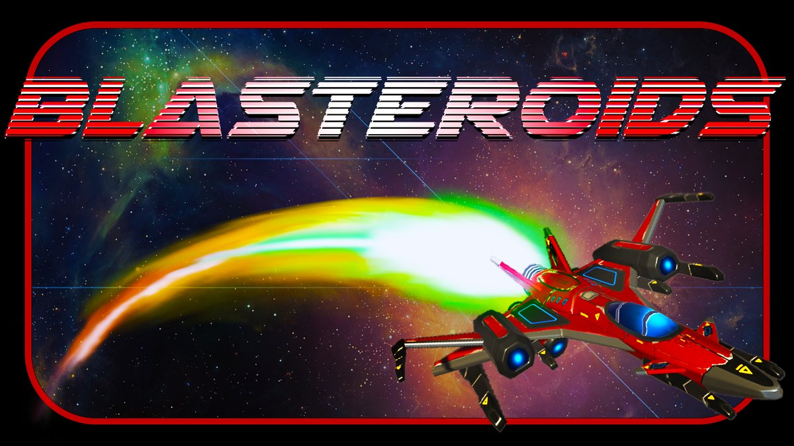

**An arcade space shooter**

Blast your way through an enemy-swarmed asteroid field and see how many points you can rack up.

<!-- Add a gameplay GIF here:  -->

---

## ✨ Features

- **Three weapons:** rapid-fire lasers, homing missiles that fan out and chase the nearest enemy, and a screen-clearing nuke
- **Limited ammo** with a 30-round visual ammo counter
- **Power-ups:** speed boost, triple shot, shields, health, ammo, and nukes
- **Negative power-ups:** a speed-down debuff you'll want to dodge
- **Tractor beam** that pulls nearby power-ups toward you
- **Smarter enemies** that dodge incoming fire, ram you when you're beside them, or chase you down
- **Smart spawning** that reads the game state, so you get ammo when you're empty and never a speed boost you can't use
- **Camera shake** and HUD messages for feedback

## 🎮 Controls

| Action | Input |
|---|---|
| Move | **WASD** / **Arrow keys** |
| Speed boost | **Left Shift** |
| Fire lasers | **Left click** |
| Homing missiles | **Right click** |
| Nuke | **Space** |
| Tractor beam | **C** (hold) |
| Pause | **Esc** |
| Restart / Quit (game over) | **R** / **Q** |

## 👥 Credits

| Name | Role |
|---|---|
| **Clint Wagoner** | Game design, programming, sound & music |

A **Red Rook Interactive** game. Built as a [GameDevHQ](https://gamedevhq.com) boot camp project and expanded well past the course.

3D ship models, textures, and some starter sprites are third-party assets from the Unity Asset Store and GameDevHQ.

## 🛠️ Tech

- **Engine:** Unity 2021.3.16f1 (LTS), C#
- **Audio:** Ableton Live
- **Art tools:** Aseprite, Photoshop
- **Builds:** WebGL, Windows, macOS

## 🧱 How It's Built

All gameplay code lives in `Assets/Scripts/`: 19 hand-written C# files, about 1,900 lines.

| Area | Scripts | What they do |
|---|---|---|
| **Player** | `Player` `Shooting` | Movement, speed boost, shields, health, damage, tractor beam, lasers, triple shot, ammo, missiles, nuke |
| **Enemies** | `Enemy` `Asteroid` `Swarmer` `HomingTrigger` | Dodging, ramming, homing pursuit, asteroid behavior |
| **Projectiles** | `Laser` `HomingMissile` `Nuke` `DestroyProjectileContainer` | Shots, nearest-target homing, the nuke's expanding blast |
| **Collectibles** | `PowerUp` | Seven power-up types, dispatched by ID |
| **Managers** | `GameManager` `SpawnManager` | Game flow, pause, restart, waves, state-aware power-up spawning |
| **Camera** | `CameraShake` `FollowTarget` | Hit feedback and tracking |
| **UI** | `UIManager` `MainMenu` `GameOverAnimation` | HUD, ammo display, messages, menus |
| **Audio** | `AudioManager` | Sound effects and music |

### 📝 Devlog

The build is documented step by step in a **10-part tutorial series on [Medium](https://medium.com/@cwagoner78)**, covering homing missiles, enemy AI, the spawn balancing, the tractor beam, the ammo UI, and the nuke.

## ⚠️ Known Limitations

- The Z-axis clamp on enemies doesn't work, and `Enemy.cs` says so in a comment.
- In `Player.cs`, the null check after finding the thruster tests `_speedBoostStream` instead of `_thruster`, so a missing thruster would go unreported.
- Systems locate each other with `GameObject.Find` and `FindObjectOfType` (26 calls across four scripts) rather than serialized references.

## ▶️ Running the Project

1. Install **Unity 2021.3.16f1** through Unity Hub.
2. Clone this repo and open the folder in Unity Hub.
3. Open **`Title`** from `Assets/Scenes` and press **Play**.

## 📜 Version History

Developed from March to December 2023. The full commit history is here, so you can follow each feature as it was added.

---

© 2023 **Red Rook Interactive**. All rights reserved.

